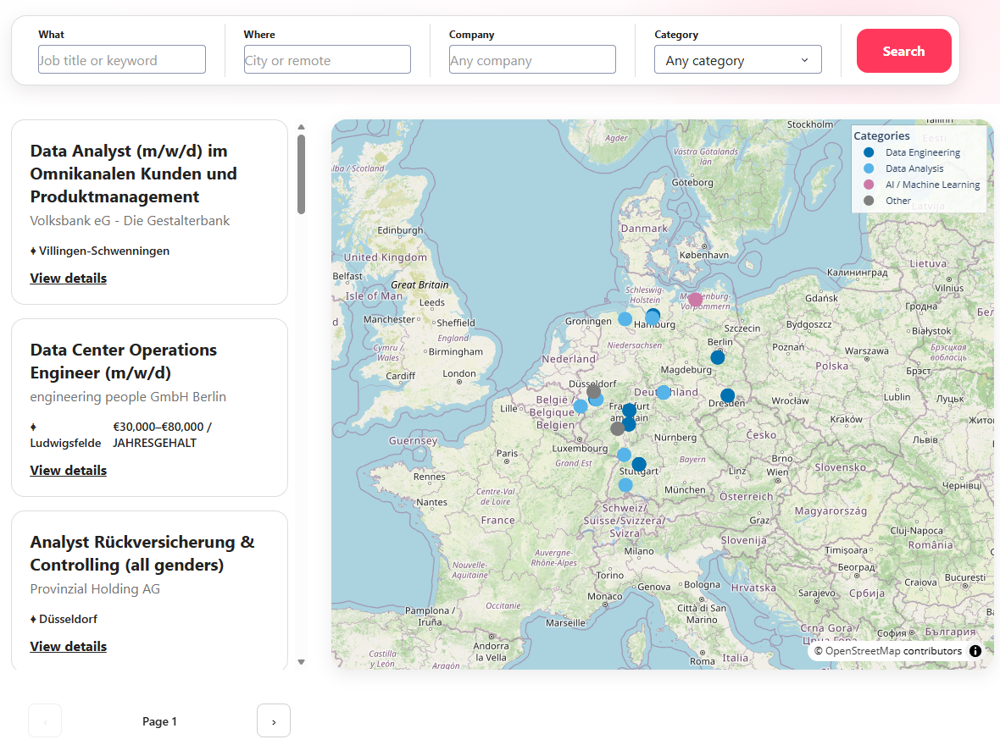
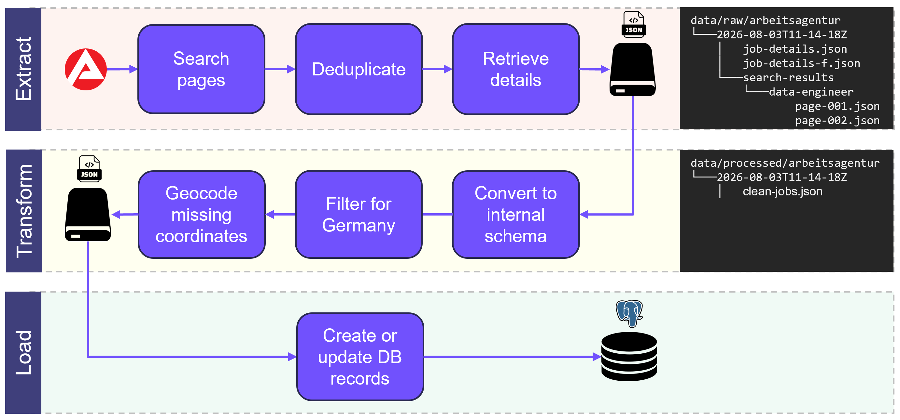
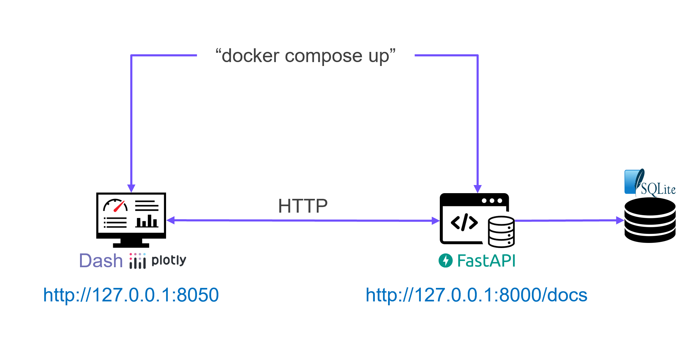
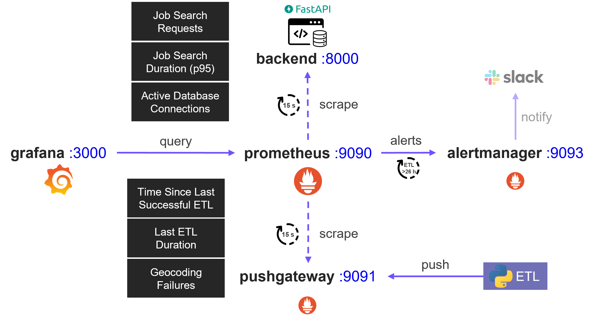

# Project 'Job-Market'




## Architecture

### Project Folder Structure

#### Code

```text
src
|
+---api
|   |   main.py
|   |       FastAPI entry point
|   |
|   +---routes
|       |   health.py
|       |       health-check endpoint to verify that the API is running
|       |
|       |   jobs.py
|       |       endpoints for searching jobs and retrieving individual job details
|       |
|       |   statistics.py
|       |       statistical endpoints for jobs, companies, locations, and home-office availability, and categories
|
+---config
|   |   settings.py
|   |       shared configuration such as paths, ports, and API URLs
|
+---dashboard
|   |   callbacks.py
|   |       handles dashboard interactions and API requests
|   |
|   |   jobs.py
|   |       creates job cards, job details, and the category-colored map
|   |
|   |   layouts.py
|   |       defines the Dash page layout
|   |
|   |   statistics.py
|   |       creates job-market statistics charts
|   |
|   +---assets
|       |   styles.css
|       |       visual styling and layout of the Dash frontend
|
+---data
|   |   arbeitsagentur_client.py
|   |       retrieves jobs from the Arbeitsagentur API
|   |
|   |   database.py
|   |       provides shared PostgreSQL database access
|   |
|   |   job_category_classifier.py
|   |       assigns standardized categories to jobs
|   |
|   |   job_location_geocoder.py
|   |       adds missing latitude and longitude coordinates
|   |
|   +---etl
|       |   etl.py
|       |       runs the complete Extract-Transform-Load pipeline
|       |
|       |   extract_data.py
|       |       downloads and stores raw job data
|       |
|       |   transform_data.py
|       |       converts raw jobs to the internal schema, assigns categories, and geocodes locations
|       |
|       |   load_data.py
|               creates/updates PostgreSQL records
|
+---tests
|   |   test_smoke.py
|   |       ensures that the GitHub Actions test workflow does not fail
```

#### Generated Data

```text
data
|
+---processed
|   \---arbeitsagentur
|       \---<timestamp>
|           |   clean-jobs.json
|           |       transformed and enriched job data
|
\---raw
    \---arbeitsagentur
        \---<timestamp>
            |   job-details.json
            |       raw job details retrieved from the API
            |
            |   job-detail-failures.json
            |       failed job-detail requests
            |
            \---search-results
                +---<keyword>
                |       page-001.json
                |       raw search results for one keyword
                |
                \---...
```

### Project Overview


### Ingestion



### Docker Deployment



### Monitoring



## Usage

> **Note:** Every command in this section is assumed to be run from the project root directory.

### Populate or update the job database

Run:

```sh
./docker_update_data.sh --keyword "Data Engineer" --keyword "Data Analyst" --keyword "AI Engineer"
```

You can replace these search terms or add more --keyword arguments. If no `--keyword` arguments are provided, the default search terms configured in `src/config/settings.py` are used.

### Local Development

#### Setup Python

```sh
python -m venv .venv
source .venv/bin/activate
python -m pip install --upgrade pip
pip install -r requirements.txt
```

> **Note:** If on Windows, run `.venv\Scripts\Activate.ps1` instead of `source .venv\bin\activate`.

#### Start PostgreSQL

> **Note:** Make sure no other containers from this project (aside from PostgreSQL) are running. If necessary, stop the full Docker deployment with `docker compose down` before running the next command.

```sh
docker compose up -d postgres
```

#### Start the backend API

```sh
python -m uvicorn src.api.main:api --reload
```

#### Start the Dash frontend

```sh
python -m src.dashboard.app
```

### Deployment with Docker

Start the application:

```sh
./docker_start.sh
```

### Open in your browser

**Swagger (Backend):** http://127.0.0.1:8000/docs

**Dash (Frontend):** http://127.0.0.1:8050

**Airflow:** http://127.0.0.1:8080

**Prometheus:** http://127.0.0.1:9090

**Prometheus-Alertmanager:** http://127.0.0.1:9093

**Grafana:** http://127.0.0.1:3000

---

> Project is based on the [Cookiecutter Data Science project template](https://drivendata.github.io/cookiecutter-data-science/). #cookiecutterdatascience
